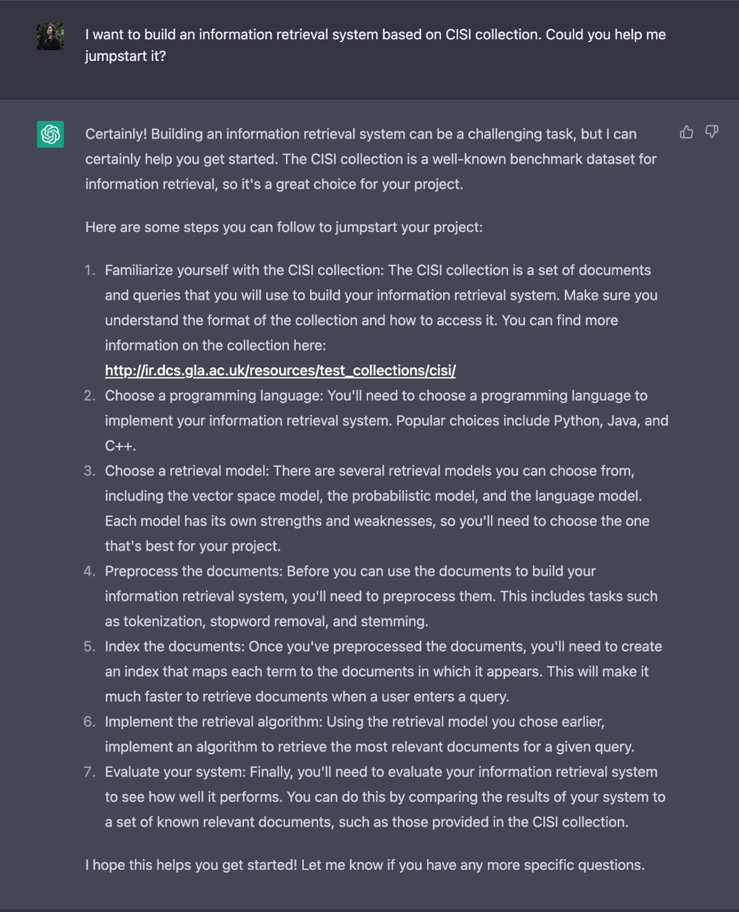
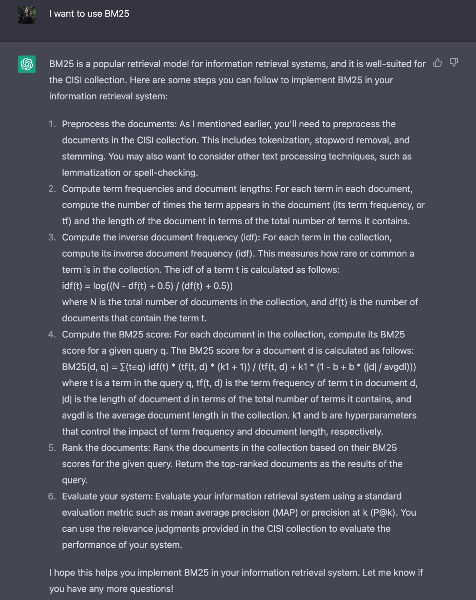
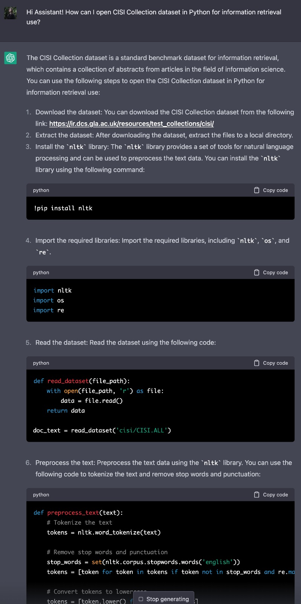
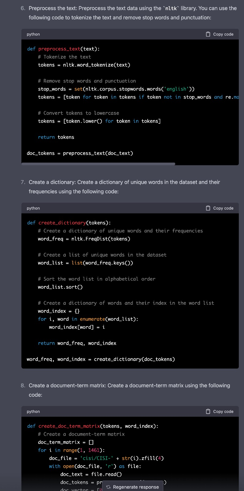
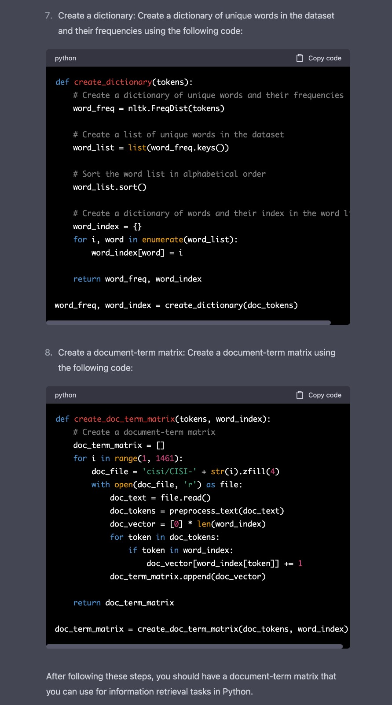
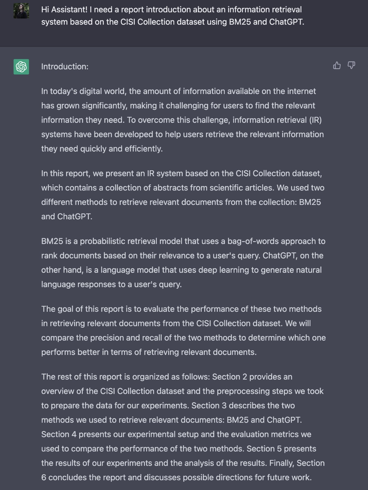
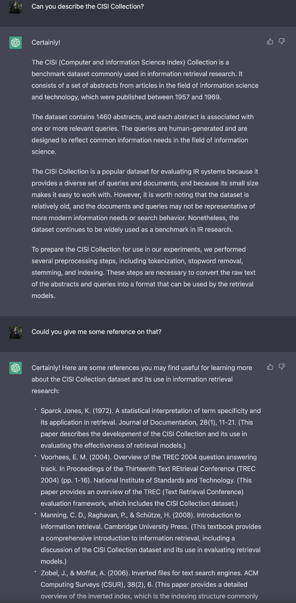
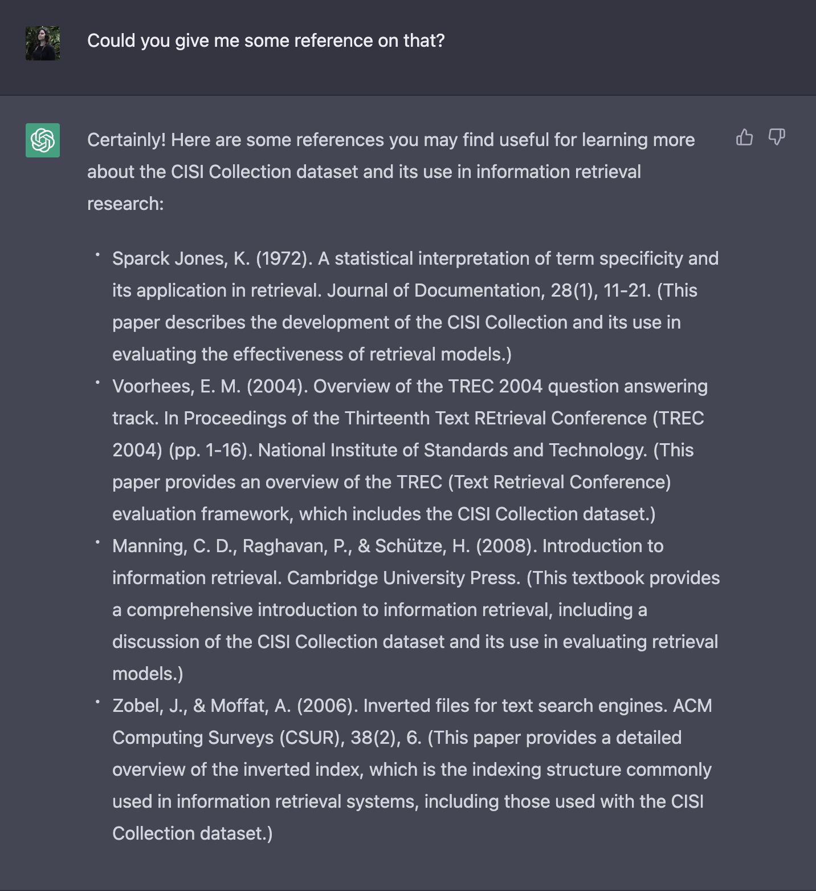
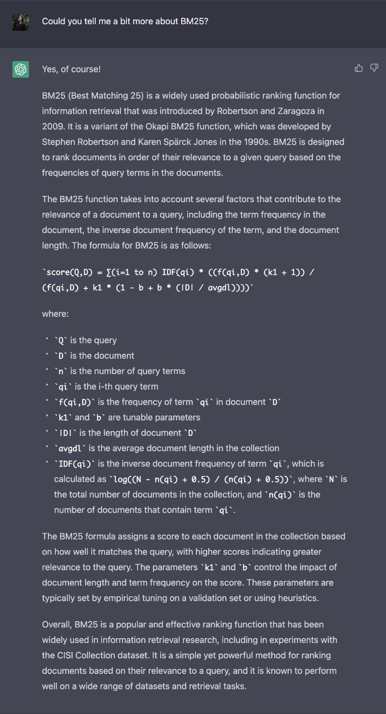

# Building a Simple Information Retrieval System using BM25 and GPT-3 and evaluated in the CISI collection

By Júlia Ferreira Tessler
_(originally published in https://github.com/juliatessler/2023-dl-for-search-selection)_

This repo contains my solution to the [exercise](https://docs.google.com/document/d/1Ini6CeCkjD_HsFdkj1wXsY_xaoSVThkKicpfsHuYtNw/edit?usp=sharing) proposed by prof. Lotufo and prof. Rodrigo as a selection mechanism for Deep Learning Applied to Search.

## Repo structure

All code here is intended to run on Google Colab and contained inside `Exercise.ipynb`. You can simply click on "Open in Colab" and the notebook will open as intended. To test the code, you must run all of the notebook. This will download the dataset, treat it for information retrieval use and apply BM25 for information retrieval on example queries. The second to last notebook cell can be used to test the system on whatever query you choose or type.

The report on the work and the exercise is in this README page. The `images/` file contains the screenshots from my conversations with ChatGPT for this project.

---
## Report

### 1. Introduction
*(mostly written by ChatGPT)*

In today's digital world, the amount of information available on the internet has grown significantly, making it challenging for users to find the relevant information they need. To overcome this challenge, information retrieval (IR) systems have been developed to help users retrieve the relevant information they need quickly and efficiently.

In this report, we present an IR system based on the CISI Collection dataset, which contains a collection of abstracts from scientific articles *(note from Júlia: I wasn't able to confirm that information, but it seems accurate based on what I found and seen during this project about CISI Collection)*. We used BM25 to retrieve relevant documents from the collection and ChatGPT as a source of information, code and text for the report.

BM25 is a probabilistic retrieval model that uses a bag-of-words approach to rank documents based on their relevance to a user's query. ChatGPT, on the other hand, is a language model that uses deep learning to generate natural language responses to a user's query.

The rest of this report is organized as follows: Section 2 provides an overview of the CISI Collection dataset and the preprocessing steps we took to prepare the data for our experiments. Section 3 describes the two methods we used to retrieve relevant documents: BM25 and ChatGPT. Finally, Section 4 presents the results and concludes the report. After the report, one can find the full prompts and responses that were fed to ChatGPT during this project.

### 2. CISI Collection data

*(somewhat written by ChatGPT)*

The [CISI (Computer and Information Science Index) Collection](http://ir.dcs.gla.ac.uk/resources/test_collections/cisi/) is a public benchmark dataset commonly used in information retrieval research and available from the [University of Glasgow](http://ir.dcs.gla.ac.uk/resources/test_collections/cisi/) [1]. It consists of a set of abstracts from articles in the field of information science and technology, which were published between 1957 and 1969.

The dataset contains 1,460 abstracts, and each abstract is associated with one or more relevant queries (there are 112 queries). The queries are human-generated and are designed to reflect common information needs in the field of information science.

The CISI Collection is a popular dataset for evaluating IR systems because it provides a diverse set of queries and documents, and because its small size makes it easy to work with. However, it is worth noting that the dataset is relatively old, and the documents and queries may not be representative of more modern information needs or search behavior. Nonetheless, the dataset continues to be widely used as a benchmark in IR research.

The dataset is separated in 3 files [1]:

- `CISI.ALL`: A file of 1,460 "documents" each with a unique ID (.I), title (.T), author (.A), abstract (.W) and list of cross-references to other documents (.X). It is the dataset for training IR models when used in conjunction with the Queries (`CISI.QRY`).
- `CISI.QRY`: A file containing 112 queries each with a unique ID (.I) and query text (.W).
- `CISI.REL`: A file with the ground-proof of query-document matching. It is the mapping of query ID (column 0) to document ID (column 1). A query may map to more than one document ID.

Gathering information about this dataset isn't easy and much from what was learnt about it comes from Kaggle.

### 3. BM25

BM25 is a probabilistic ranking function used by search engines. It is often called Okapi's BM25 after the first system in which it was implemented. Probabilistic information retrieval relies on knowing what documents are and aren't relevant, so it is possible to estimate the probability of a term $t$ appearing in a relevant document, that is, $P(t|R=1)$ (Manning, 2008 [2]).

For this project, we chose to use `rank_bm25` [Python implementation](https://pypi.org/project/rank-bm25/). The library has different versions of BM25 algorithms, which are described in Trotman et al. (2014) [3]. In this implementation, it indexes a given tokenized corpus and scores the documents using BM25. It is also able to rank the documents.

Before tokenizing and indexing the corpus, we applied some treatments to the text, such as:

- lowercase all text
- remove punctuation
- remove English common stopwords
- apply a Porter stemmer

There is some discussion on the need of stemming for search systems and whether or not a lemmatization could be better than stemming (Manning, 2008 [2]). Trotman et al. (2014) [3] found the best results using BM25 without stemmers or lemmatizers.

### 4. Results and Conclusion

After successfully building a information retrieval system for the CISI Collection using BM25, we decided to use [Mean Reciprocal Rank](https://softwaredoug.com/blog/2021/04/21/compute-mrr-using-pandas.html) (MRR@k) to evaluate the system results against the golden standard provided in the dataset. MRR is a measurement of how far down the ranking the first relevant document is and it uses the top k documents. The closer MRR is to 1, the better - it means that relevant results are close to 1 (similarly, the closer to 0, the poorer your search quality is, because the relevant answer is farther down the result list) [4]. The choice of using MRR instead of Mean Average Precision (MAP@k) is because MRR only cares for the first relevant document, regardless of the rest of the ranking (or how many relevant documents there are). For this project, Okapi's BM25 applied to CISI Collection achieved 43.88% of MRR@5.

Some of the next steps for this project would include testing the BM25 algorithm with lemmatizers, instead of stemmers, as well as trying some other versions of BM25 to check if it's enough to improve MRR@5.

#### Notes on achieving the project's evaluation criteria

### References

- [1] [Kaggle dataset description: CISI (a dataset for Information Retrieval)](https://www.kaggle.com/datasets/dmaso01dsta/cisi-a-dataset-for-information-retrieval). Accessed February 22nd, 2023.

- [2] Manning, C. D., Raghavan, P., & Schütze, H. (2008). Introduction to information retrieval. Cambridge University Press. Also available at https://nlp.stanford.edu/IR-book/information-retrieval-book.html (accessed February 22nd, 2023).

- [3] Trotman, A., Puurula, A., & Blake Burgess. (2014). Improvements to BM25 and Language Models Examined. In Proceedings of the 2014 Australasian Document Computing Symposium (ADCS '14). Association for Computing Machinery, New York, NY, USA, 58–65. https://doi.org/10.1145/2682862.2682863

- [4] [Doug Turnbull blogpost: Compute Mean Reciprocal Rank (MRR) using Pandas](https://softwaredoug.com/blog/2021/04/21/compute-mrr-using-pandas.html). Accessed February 22nd, 2023.

---
## On ChatGPT usage

Everytime I used ChatGPT information or code is marked as such. Here are the prompts I wrote for it, followed by the answers I got:

### Directions to get started

I had never used ChatGPT to start a project, so this was quite interesting. I asked for some ideas on how to build an information retrieval system based on the CISI Collection dataset. The assistant told me to take the following steps:

1. Familiarize yourself with the dataset, along with the same link that was provided with project instructions (which didn't contain as much information on the dataset as I would have hoped for).
1. Choose a programming language (maybe I should have told the assistant that I was about to build the project in Python).
1. Choose a retrieval model (we already knew we were about to use BM25 for it).
1. Preprocess documents.
1. Index documents.
1. Implement the retrieval algorithm.
1. Evaluate the system.

All in all, it looked quite ok.

Right after that first question, I told the assistant that I wanted to use BM25 and it kind of gave me the same steps as before, but adapted for BM25. I didn't check the math it suggested here, but it looks similar to [what Wikipedia has on Okapi's BM25](https://en.wikipedia.org/wiki/Okapi_BM25).

### Help on code

As mentioned, I didn't find that much information on the CISI Collection dataset, so I asked the assistant how to open the data in Python for information retrieval use. It started spitting out code chunks with some explanation in between them. As it turned out, opening the dataset for use wasn't quite as the code suggested, but I was able to evolve from there.

I also didn't use much of the code that the assistant gave me and chose to use a library that was already implemented.

### Help on writing the report

I asked the assistant for help on writing this report's introduction and some explanations.

When I asked for more information on BM25, something seemed a bit off. I asked for BM25, simply, and I expected the assistant to give me some context on Okapi's BM25 as the base form of the system.

